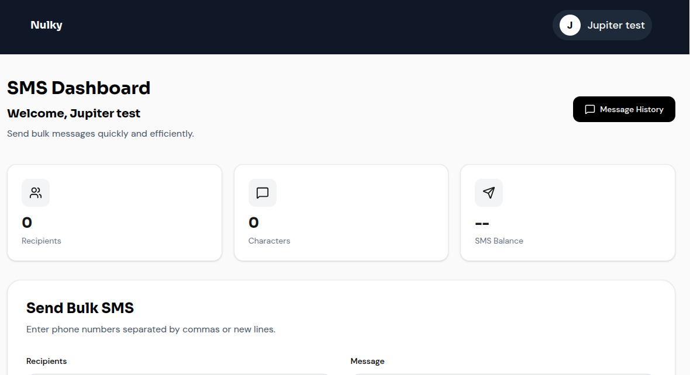
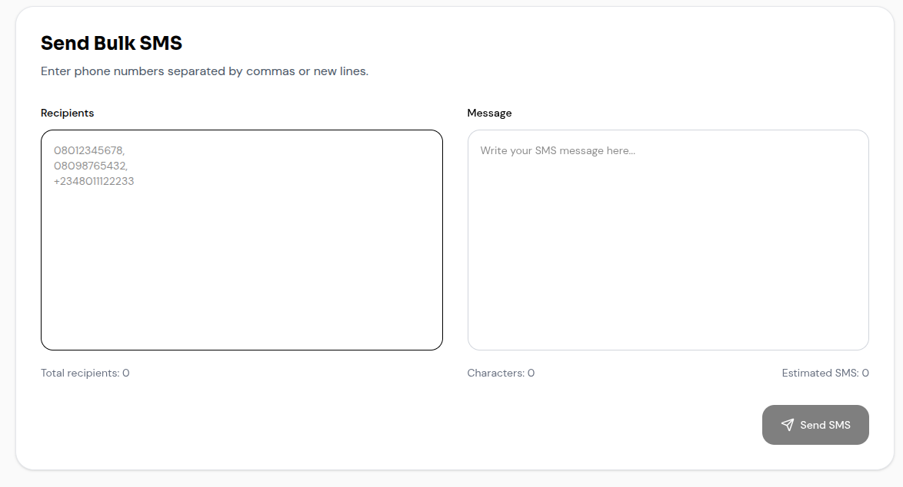

# NULKY

A modern and responsive bulk SMS application built with **Next.js**, **TypeScript**, and **Tailwind CSS**.
This application provides a clean user experience for authentication, SMS campaign management, and message history tracking.

---

# 🚀 Features

- 🔐 Authentication UI
  - Login
  - Signup
  - Forgot Password
  - Reset Password

- 📩 Bulk SMS Dashboard
  - Send SMS to multiple recipients
  - Character counter
  - Recipient counter
  - Estimated SMS count

- 👤 User Experience
  - Responsive navigation
  - User profile dropdown
  - Protected dashboard flow
  - Toast notifications

- 📜 Message History
  - Track sent messages
  - View recipient lists
  - View timestamps
  - Local history storage

- 🎨 Modern UI
  - Responsive design
  - Framer Motion animations
  - Clean SaaS-inspired layout
  - Mobile-friendly experience

---

# 🛠 Tech Stack

- Next.js
- React
- TypeScript
- Tailwind CSS
- Framer Motion
- Lucide React

---

## 📸 Architecture & Preview




# ⚙️ Installation

## Clone Repository

```bash
git clone <https://github.com/Nnenna-udefi/bulk_sms.git>
```

---

# 📦 Install Dependencies

```bash
npm install
```

---

# 🔑 Environment Variables

Create a `.env.local` file in the root directory:

```env
NEXT_PUBLIC_API_URL=http://localhost:6000/api
```

Replace the URL with your deployed backend API URL in production.

---

# ▶️ Run Development Server

```bash
npm run dev
```

Application runs on:

```bash
http://localhost:3000
```

---

# 🏗 Production Build

```bash
npm run build
```

Start production server:

```bash
npm start
```

---

# 🔐 Authentication Flow

## Signup

Users can:

- Create an account
- Validate password strength
- Access the dashboard after login

## Login

Users can:

- Authenticate securely
- Persist session using localStorage
- Access protected pages

## Forgot Password

Users can:

- Request password reset email
- Reset password using tokenized link

---

# 📩 SMS Dashboard

The dashboard allows users to:

- Enter multiple phone numbers
- Separate recipients using commas or new lines
- Write bulk SMS campaigns
- Track SMS balance
- View message status

Supported phone formats:

```text
08012345678
2348012345678
+2348012345678
```

---

# 📜 Message History

The application stores SMS history locally in the browser.

History includes:

- Message content
- Recipients
- Delivery status
- Date and time

---

# 🎨 Design System

## Fonts

- Sora → Headings
- DM Sans → Body text

## UI Style

- Minimal
- Responsive
- Clean dashboard layout
- Rounded cards
- Soft shadows

---

# 📱 Responsive Design

Optimized for:

- Mobile devices
- Tablets
- Desktop screens

---

# Backend Repository

https://github.com/nedu-ramzi/bulk_sms

# 🚀 Deployment

- [Nulky App](https://nulky.vercel.app/)

Recommended frontend hosting:

- [Vercel](https://vercel.com?utm_source=chatgpt.com)

---

# 🔧 Deploy on Vercel

## Install Vercel CLI

```bash
npm install -g vercel
```

## Deploy

```bash
vercel
```

---

# 🔑 Production Environment Variable

Add this in your Vercel project settings:

```env
NEXT_PUBLIC_API_URL=https://your-backend-api.com/api
```

---

# 📌 Future Improvements

- Campaign scheduling
- CSV upload support
- Contact groups
- Delivery reports
- SMS analytics
- Dark mode
- Admin panel
- Real-time SMS status updates

---

# 🤝 Contribution

## Fork the repository

```bash
git fork
```

## Create feature branch

```bash
git checkout -b feature-name
```

## Commit changes

```bash
git commit -m "Added new feature"
```

## Push changes

```bash
git push origin feature-name
```

## Open Pull Request

---

# 📄 License

MIT License

---

# 👨‍💻 Author

## Frontend

- [Nnenna Udefi](https://github.com/Nnenna-udefi)

## Backend

- [Chinedu Ramsey](https://github.com/nedu-ramzi)
